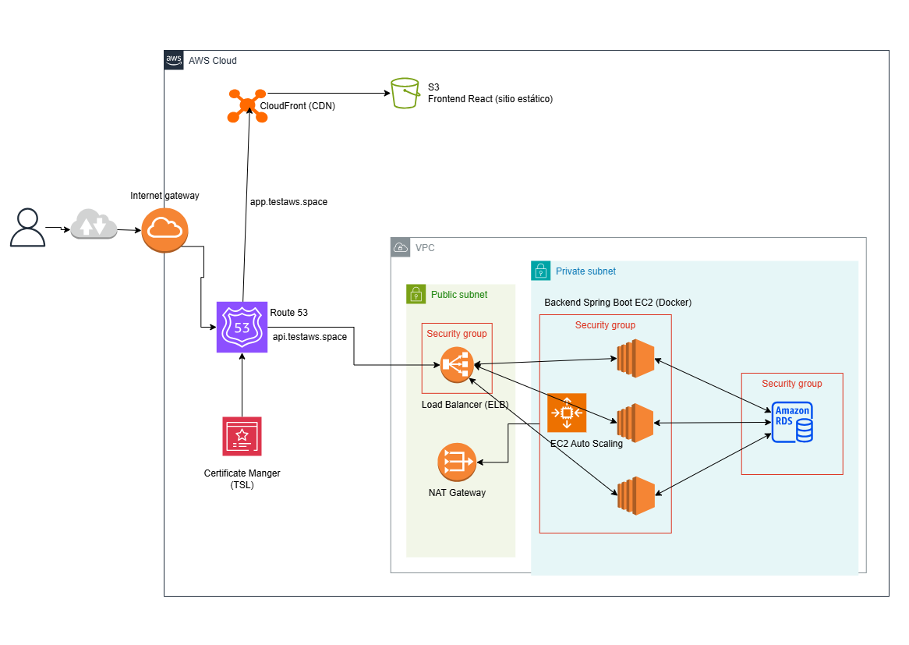

# Fullstack-Project-API-REST-JWT-AWS

Proyecto completo que integra una API REST desarrollada en **Spring Boot** y una interfaz web moderna hecha en **React + Tailwind**. Incluye autenticación con **JWT y OAuth2**, control de acceso por roles, pruebas automatizadas y **despliegue completo en AWS (EC2, ALB, Auto Scaling, S3, CloudFront)**.

---

## 📂 Repositorios del Proyecto

- 🔙 **Backend (Spring Boot + JWT + OAuth2 + MySQL)**  
  👉 [Ir al repositorio backend](https://github.com/Borghii/Backend-API-REST-JWT-OAuth)

- 🔜 **Frontend (React + Vite + Tailwind CSS)**  
  👉 [Ir al repositorio frontend](https://github.com/Borghii/Frontend-API-REST-JWT-OAuth)

## 🔧 **Infraestructura (AWS)**

