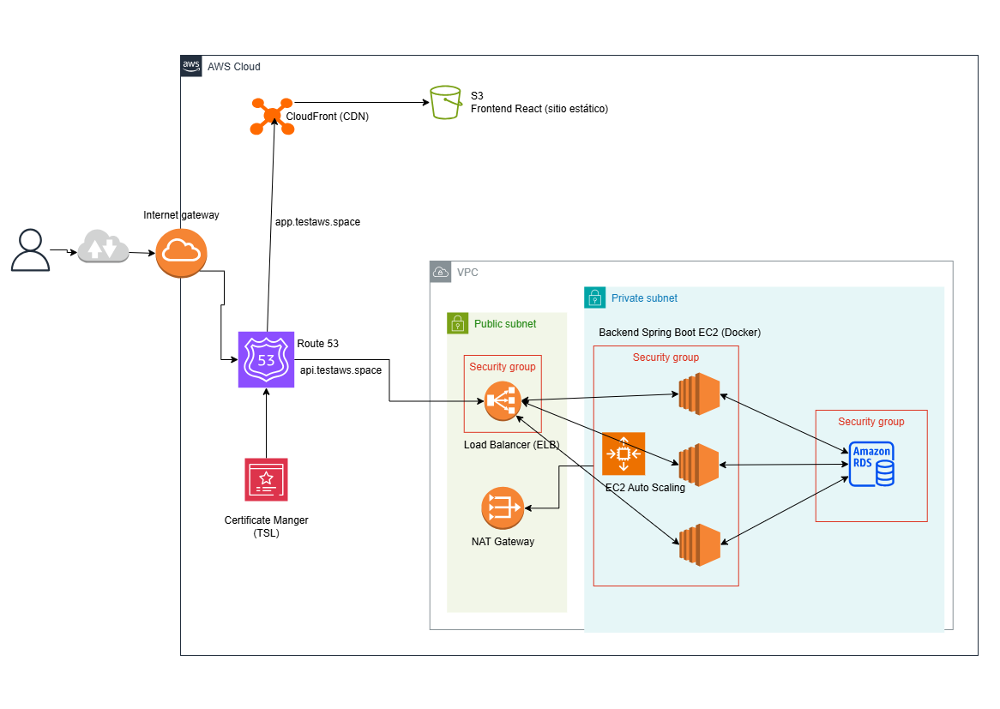
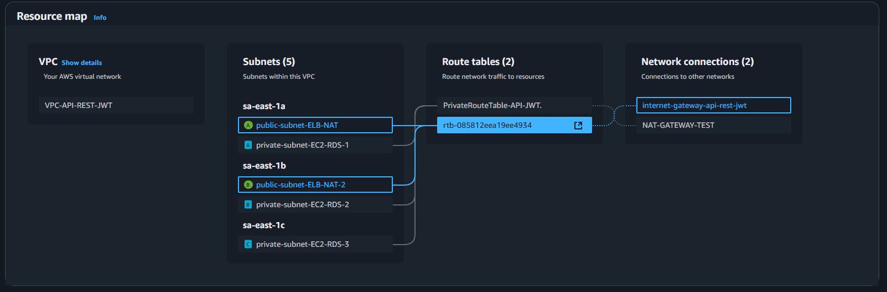
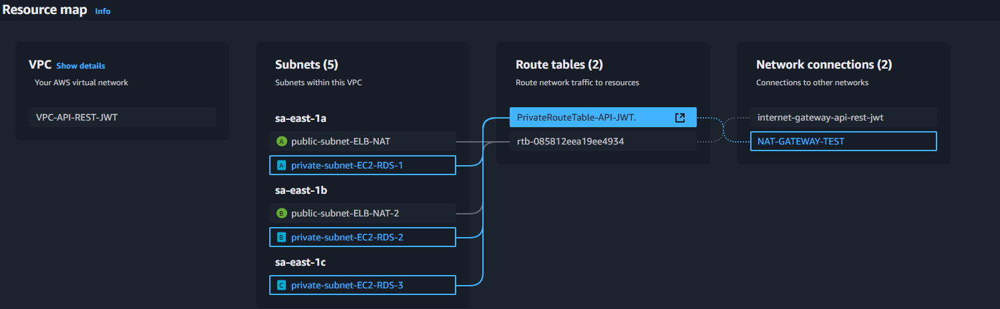
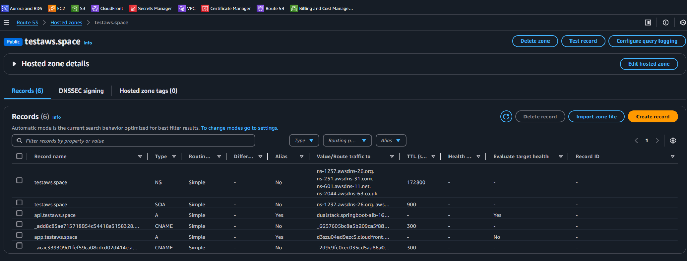
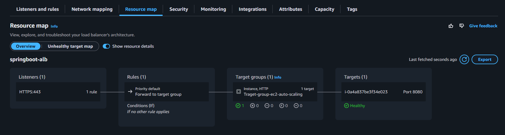

# Fullstack-Project-API-REST-JWT-AWS

Proyecto completo que integra una API REST desarrollada en **Spring Boot** y una interfaz web moderna hecha en **React + Tailwind**. Incluye autenticación con **JWT y OAuth2**, control de acceso por roles, pruebas automatizadas y **despliegue completo en AWS (EC2, ALB, Auto Scaling, S3, CloudFront)**.

---

## 📂 Repositorios del Proyecto

- 🔙 **Backend (Spring Boot + JWT + OAuth2 + MySQL)**  
  👉 [Ir al repositorio backend](https://github.com/Borghii/Backend-API-REST-JWT-OAuth)

- 🔜 **Frontend (React + Vite + Tailwind CSS)**  
  👉 [Ir al repositorio frontend](https://github.com/Borghii/Frontend-API-REST-JWT-OAuth)

## ☁️ Arquitectura en AWS

El proyecto fue desplegado completamente en **AWS**, con una infraestructura escalable, segura y distribuida globalmente:

### 🗺️ Diagrama general



---

### 📌 Componentes principales

| Componente                | Descripción                                                                                                          |
| ------------------------- | -------------------------------------------------------------------------------------------------------------------- |
| **Route 53**              | Gestión de DNS, apunta `app.testaws.space` a CloudFront (frontend) y `api.testaws.space` al Load Balancer (backend). |
| **Certificate Manager**   | Certificados SSL/TLS validados por DNS para ambos subdominios.                                                       |
| **CloudFront**            | CDN global que distribuye la SPA de React alojada en S3 con HTTPS y política de acceso restringida al bucket.        |
| **S3 Bucket**             | Almacén estático para el frontend de React. Solo accesible desde CloudFront.                                         |
| **EC2 Instance**          | Instancia Dockerizada para el backend (Spring Boot).                                                                 |
| **Elastic Load Balancer** | Distribuye tráfico a las instancias EC2 con HTTPS desde `api.testaws.space`.                                         |
| **Auto Scaling Group**    | Crea y elimina instancias EC2 automáticamente según demanda.                                                         |
| **Launch Template**       | Plantilla base para nuevas instancias (configura Docker + app).                                                      |
| **RDS MySQL**             | Base de datos relacional gestionada por Amazon, alojada en subredes privadas.                                        |
| **VPC & Subnets**         | Red virtual con subredes públicas y privadas (usadas por EC2 y RDS).                                                 |
| **NAT Gateway**           | Permite que las subredes privadas accedan a internet (para actualizaciones).                                         |
| **Security Groups**       | Reglas de firewall para EC2, RDS y el Load Balancer.                                                                 |

---

### 🛠️ Launch Template (User Data Script usado por EC2)

```bash
#!/bin/bash
sudo apt update
sudo apt install -y docker.io
sudo systemctl enable docker
sudo systemctl start docker
sudo usermod -aG docker ubuntu

docker run -d   -p 8080:8080   --name api-rest-jwt   -e SPRING_AI_OPENAI_API_KEY=TU_API_KEY   -e SPRING_DATASOURCE_USERNAME=root   -e SPRING_DATASOURCE_PASSWORD=test1234   -e SPRING_DATASOURCE_URL="jdbc:mysql://database-api-rest-jwt.xxxxxx.rds.amazonaws.com:3306/project-api-rest?createDatabaseIfNotExist=true&serverTimezone=UTC"   -e ALLOWED_ORIGINS=https://app.testaws.space   bichiborghi/api-rest-jwt:1.0.0
```

---

### 🔐 Seguridad

- Las instancias EC2 están en subredes públicas pero con reglas que solo permiten acceso desde el **Load Balancer**.
- La base de datos RDS se encuentra en **subredes privadas** y solo acepta conexiones desde las EC2.
- **S3** solo es accesible desde **CloudFront**, evitando exposición directa.

---

### 🌍 Redirecciones personalizadas con Route 53

| Subdominio          | Servicio destino                |
| ------------------- | ------------------------------- |
| `app.testaws.space` | CloudFront → S3 SPA             |
| `api.testaws.space` | ALB → EC2 (Spring Boot backend) |

---

## ✅ Resultado

Gracias a esta arquitectura:

- El backend escala automáticamente ante carga.
- El frontend está distribuido globalmente y es altamente disponible.
- Toda la app opera bajo HTTPS con dominios personalizados.
- La base de datos está segura en una red privada.
- Las variables sensibles se manejan desde **AWS SSM Parameter Store**.

---

## 📌 Sección: Implementación en AWS (Visualización)

### VPC(Virtual Private Cloud)




### Route 53



### Load Balancer




https://github.com/user-attachments/assets/d09dd80c-0120-47b0-b565-b5da85f63503


https://github.com/user-attachments/assets/770f20c1-7f5e-472c-9050-f000623b2c2d


